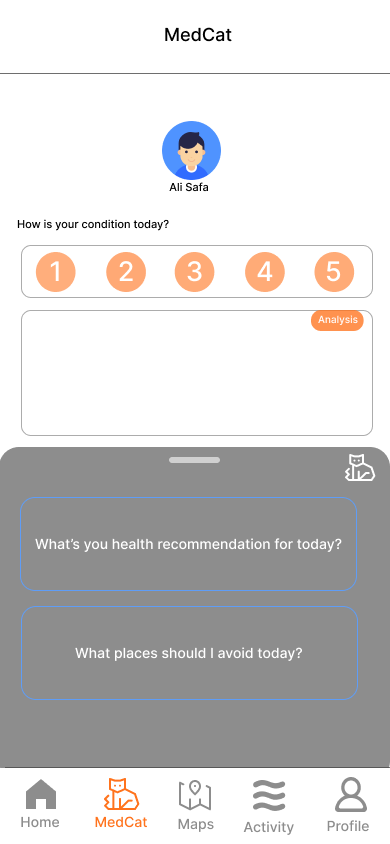
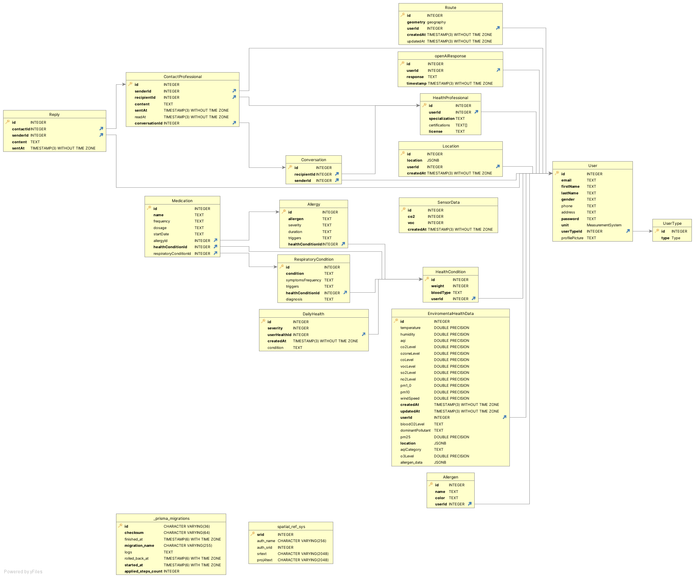

<br><br>

<!-- project philosophy -->


> A mobile app for optimizing health management with real-time enviromental data.
>
> This app combines user profiles, medical history, symptom tracking, and real-time indoor and outdoor environmental data with heatmap visuals. It uses AI analysis to offer personalized recommendations.

### User Stories
- As an individual with respiratory problems, I need to monitor and receive real-time alerts about the air quality of my current location and those I plan to visit.
- As a cyclist with allergies, I want to access real-time environmental data on pollen levels and air quality as I plan for an activity to minimize allergens.
- As a healthcare professional, I need access to real-time environmental data alongside my patients' health information, enabling me to make informed clinical assessments and provide tailored recommendations.

<br><br>

<!-- Prototyping -->


###  AiroWave is built using the following technologies:

-  This project uses the [Flutter app development framework](https://flutter.dev/). Flutter is a cross-platform hybrid app development platform that allows us to use a single codebase for apps on mobile, desktop, and the web.
- For Database, the app utilizes [PostgreSQL](https://www.postgresql.org/) as the backend database management system, providing a robust and scalable solution for data storage.
- The backend is implemented using [Node.js](https://nodejs.org/) along with [Prisma](https://www.prisma.io/) for efficient and type-safe database access and smooth communication.
- To monitor indoor air quality, the project incorporates an [Arduino Uno](https://store.arduino.cc/products/arduino-uno-rev3/) with a [CSS811 air quality sensor](https://learn.adafruit.com/adafruit-ccs811-air-quality-sensor/overview). This hardware component enables real-time tracking and analysis of indoor air quality parameters.
- For outdoor air quality data, the app integrates data from [Google's Air Quality API](https://developers.google.com/maps/documentation/urls/get-started#directions-action) to provide users with information about the air quality in their outdoor surroundings.
- To track plant/pollen allergens, the project leverages data from [Google's Pollen API](https://www.google.com/search?q=pollen+api) to give users insights into plant-related allergens in their area.
- For visualizing data on maps, the project integrates heatmap tiles on maps from [Google Maps Platform](https://cloud.google.com/maps-platform/), enhancing the user experience with geospatial information.
- The project incorporates a chatbot powered by [OpenAI](https://www.openai.com/) to analyze the data and provide with personalized recommendations.

<br><br>


> AiroWave was designed using wireframes and mockups, where a careful attention to user interface and user experience ensured visually appealing and intuitive design..


### Mockups
| Home screen  | Health Screen | Profile Screen |
| ---| ---| ---|
|  |  |  |

<br><bar>


###  User-Centric Data Management:

The data model, utilizing PostgreSQL, includes user profiles, medical history, symptom tracking, and real-time indoor and outdoor environmental data. Ensuring a comprehensive approach to user-centric health information and the enviromental conditions around the user. 




<br><br>


> Using the wireframes and mockups as a guide, we implemented the Coffee Express app with the following features:

### User Screens (Mobile)
| Login screen  | Register screen | Landing screen | Loading screen |
| ---| ---| ---| ---|
|  |  |  |  |
| Home screen  | Menu Screen | Order Screen | Checkout Screen |
|  |  |  |  |


<br><br>

<br><br>


### Carefully Selected and Purified Dataset for AI insights:

Aggregated air quality metrics were calculated as averages and categorized over time, distinguishing between indoor and outdoor environments, and ensuring the latest data is passed. This method ensures a comprehensive dataset passed to the prompt that is not large in size. Additionally, allergens are added and their severity levels are precisely annotated before passing them. By specifying the user's health condition, insights are tailored for a personalized and targeted analysis.

<br><br>

<br><br>

<br><br>


<br><br>
<!-- How to run -->

> To set up Coffee Express locally, follow these steps:

### Prerequisites

This is an example of how to list things you need to use the software and how to install them.
* npm
  ```sh
  npm install npm@latest -g
  ```

### Installation

_Below is an example of how you can instruct your audience on installing and setting up your app. This template doesn't rely on any external dependencies or services._

1. Get a free API Key at [https://example.com](https://example.com)
2. Clone the repo
   ```sh
   git clone https://github.com/your_username_/Project-Name.git
   ```
3. Install NPM packages
   ```sh
   npm install
   ```
4. Enter your API in `config.js`
   ```js
   const API_KEY = 'ENTER YOUR API';
   ```

Now, you should be able to run Coffee Express locally and explore its features.
