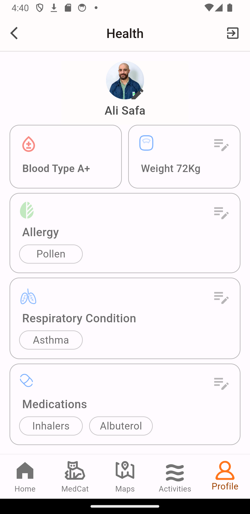

<br><br>

<!-- project philosophy -->


> A mobile app for optimizing health management with real-time enviromental data.
>
> This app combines user profiles, medical history, symptom tracking, and real-time indoor and outdoor environmental data with heatmap visuals. It uses AI analysis to offer personalized recommendations.

### User Stories
- As an individual with respiratory problems, I need to monitor and receive real-time alerts about the air quality of my current location and those I plan to visit.
- As a cyclist with allergies, I want to access real-time environmental data on pollen levels and air quality as I plan for an activity to minimize allergens.
- As a healthcare professional, I need access to real-time environmental data alongside my patients' health information, enabling me to make informed clinical assessments and provide tailored recommendations.

<br><br>

<!-- Prototyping -->


###  AiroWave is built using the following technologies:

-  This project uses the [Flutter app development framework](https://flutter.dev/). Flutter is a cross-platform hybrid app development platform that allows us to use a single codebase for apps on mobile, desktop, and the web.
- For Database, the app utilizes [PostgreSQL](https://www.postgresql.org/) as the backend database management system, providing a robust and scalable solution for data storage.
- The backend is implemented using [Node.js](https://nodejs.org/) along with [Prisma](https://www.prisma.io/) for efficient and type-safe database access and smooth communication.
- To monitor indoor air quality, the project incorporates an [Arduino Uno](https://store.arduino.cc/products/arduino-uno-rev3/) with a [CSS811 air quality sensor](https://learn.adafruit.com/adafruit-ccs811-air-quality-sensor/overview). This hardware component enables real-time tracking and analysis of indoor air quality parameters.
- For outdoor air quality data, the app integrates data from [Google's Air Quality API](https://developers.google.com/maps/documentation/urls/get-started#directions-action) to provide users with information about the air quality in their outdoor surroundings.
- To track plant/pollen allergens, the project leverages data from [Google's Pollen API](https://www.google.com/search?q=pollen+api) to give users insights into plant-related allergens in their area.
- For visualizing data on maps, the project integrates png heatmap tiles on maps from [Google Maps Platform](https://cloud.google.com/maps-platform/), enhancing the user experience with geospatial information.
- The project incorporates a chatbot powered by [OpenAI](https://www.openai.com/) to analyze the data and provide with personalized recommendations.

<br><br>


> We designed AiroWave using wireframes and mockups, iterating on the design until we reached the ideal layout for easy navigation and a seamless user experience.


### Mockups
| Home screen              | Health Screen              | Profile Screen              |
| ------------------------ | -------------------------- | ---------------------------- |
|  |  |  |

<br><bar>


###  User-Centric Data Management:

The data model, utilizing PostgreSQL, includes user profiles, medical history, symptom tracking, and real-time indoor and outdoor environmental data. Ensuring a comprehensive approach to user-centric health information and the enviromental conditions around the user. 


<br><br>


> Using the wireframes and mockups as a guide, AiroWave app with the following features:

### User Screens (Mobile)

| Login Screen                    | Register Screen                      | Landing Screen                        |
| ------------------------------- | -------------------------------------| --------------------------------------|
|     |      |    |

---

| Home Screen                     | Heatmap Allergy Screen                  | Heatmap AQI Screen                    |
| ------------------------------ | ---------------------------------------- | -------------------------------------|
|     |  |  |

---

| Chatbot Screen                  | Profile Screen                           |
| ------------------------------- | ---------------------------------------- |
|  |           |


<br><br>

<br><br>


### Curated Dataset for Enhanced AI Insight

Aggregated air quality metrics were calculated as averages and categorized, ensuring last data is passed, and distinguishing between indoor and outdoor environments. This method ensures a cohesive yet comprehensive dataset. Additionally, allergens are selected and their severity levels are specified before passing them. Lastly, By specifying the user's health condition and condition severity input, insights are tailored for a personalized and targeted analysis.

This approach relies on two functions, where user identification and message are passed to the first one, with the necessary data to pass to payload and prompt as shown below:
```javascript
async function generateOpenAIPayload(userId, userMessage) {
    
    try {

        ///////////////////////////////////Sensor Data//////////////////////////////////////////////////

        const sensorDataWithAverage = await prisma.sensorData.findMany({
            take: 150, //depends on the frequency of updates of sensor data in the database
            orderBy: {
                createdAt: 'desc',
            },
            select: {
                co2: true,
                voc: true,
                createdAt: true,
            },
        });
    
        const calculatedAverages = sensorDataWithAverage.reduce((acc, data) => {
            acc.co2.push(data.co2);
            acc.voc.push(data.voc);
            return acc;
        }, { co2: [], voc: [] });
    
        const averageCo2 = calculatedAverages.co2.reduce((sum, value) => sum + value, 0) / calculatedAverages.co2.length;
        const averageVoc = calculatedAverages.voc.reduce((sum, value) => sum + value, 0) / calculatedAverages.voc.length;
    
        const fixedCo2 = parseFloat(averageCo2.toFixed(2));
        const fixedVoC = parseFloat(averageVoc.toFixed(2));

        //////////////////////////////Outdoor Air Quality Data////////////////////////////////////////////
    
        const environmentalHealthDataWithAverage = await prisma.enviromentalHealthData.groupBy({
            where: { userId: userId },
            by: ['aqi', 'coLevel', 'o3Level', 'so2Level', 'no2Level', 'pm25', 'pm10', 'userId', 'updatedAt'],
            orderBy: {
                updatedAt: 'desc',
            },
            take: 20,
            select: {
                aqi: true,
                coLevel: true,
                o3Level: true,
                so2Level: true,
                no2Level: true,
                pm25: true,
                pm10: true,
                userId: true,
                updatedAt: true,
            },
        });
    
        const calculatedEnvironmentalAverages = environmentalHealthDataWithAverage.reduce((acc, data) => {
            acc.aqi.push(data.aqi);
            acc.coLevel.push(data.coLevel);
            acc.o3Level.push(data.o3Level);
            acc.so2Level.push(data.so2Level);
            acc.no2Level.push(data.no2Level);
            acc.pm25.push(data.pm25);
            acc.pm10.push(data.pm10);
    
            return acc;
        }, {
            aqi: [],
            ozoneLevel: [],
            coLevel: [],
            o3Level: [],
            vocLevel: [],
            so2Level: [],
            no2Level: [],
            pm25: [],
            pm10: [],
            userId: [],
        });
    
        const averageAqi = calculatedEnvironmentalAverages.aqi.reduce((sum, value) => sum + value, 0) / calculatedEnvironmentalAverages.aqi.length;
        const averageCoLevel = calculatedEnvironmentalAverages.coLevel.reduce((sum, value) => sum + value, 0) / calculatedEnvironmentalAverages.coLevel.length;
        const averageO3Level = calculatedEnvironmentalAverages.o3Level.reduce((sum, value) => sum + value, 0) / calculatedEnvironmentalAverages.o3Level.length;
        const averageSo2Level = calculatedEnvironmentalAverages.so2Level.reduce((sum, value) => sum + value, 0) / calculatedEnvironmentalAverages.so2Level.length;
        const averageNo2Level = calculatedEnvironmentalAverages.no2Level.reduce((sum, value) => sum + value, 0) / calculatedEnvironmentalAverages.no2Level.length;
        const averagePm25 = calculatedEnvironmentalAverages.pm25.reduce((sum, value) => sum + value, 0) / calculatedEnvironmentalAverages.pm25.length;
        const averagePm10 = calculatedEnvironmentalAverages.pm10.reduce((sum, value) => sum + value, 0) / calculatedEnvironmentalAverages.pm10.length;
    
        const fixedAqi = parseFloat(averageAqi.toFixed(2));
        const fixedCoLevel = parseFloat(averageCoLevel.toFixed(2));
        const fixedO3Level = parseFloat(averageO3Level.toFixed(2));
        const fixedSo2Level = parseFloat(averageSo2Level.toFixed(2));
        const fixedNo2Level = parseFloat(averageNo2Level.toFixed(2));
        const fixedPm25 = parseFloat(averagePm25.toFixed(2));
        const fixedPm10 = parseFloat(averagePm10.toFixed(2));


      //////////////Allergens data, health conditions, location, severity input/////////////////////

        const allergens = await prisma.allergen.findFirst({
            where: { userId: userId },
            orderBy: {
                id: 'desc',
            },
            select: { name: true, color: true }
        });
    
        const lastSeverityEntry = await prisma.dailyHealth.findFirst({
            select: { severity: true, userId: userId },
            orderBy: { createdAt: 'desc' }
        });
    
        const healthCondition = await prisma.healthCondition.findFirst({
            where: { userId: userId },
            select: {
                weight: true,
                bloodType: true,
                id: true
            }
        });
    
        const conditionId = healthCondition.id;
    
    
        const respiratoryConditions = await prisma.respiratoryCondition.findMany({
            where: { healthConditionId: conditionId },
            select: {
                condition: true,
                symptomsFrequency: true,
                triggers: true,
                healthConditionId: true
            }
        });
    
        const allergies = await prisma.allergy.findMany({
            where: { healthConditionId: conditionId },
            select: {
                allergen: true,
                severity: true,
                duration: true,
                triggers: true
            }
        });
    
        const lastLocation = await prisma.location.findFirst({
            orderBy: {
                id: 'desc',
            },
            select: {
                location: true
            }
        });

        const medications = await prisma.medication.findMany({
            where: {healthConditionId: conditionId},
            select: {
                name: true,
                startDate: true,
                frequency: true,
                dosage: true,
                allergyId:true,
                respiratoryConditionId:true,
            }
        });
    
        const ConditionSeverityInput = (severity) => {
            if (severity >= 4) {
                return 'User health condition severity is high';
            } else if (severity >= 2) {
                return 'Your health condition severity is moderate.';
            } else {
                return 'Your health condition severity is low.';
            }
        };

        const determineAllergenSeverity = (color) => {
            if (color === 'secondary') {
                return 'low';
            } else if (color === 'primary') {
                return 'moderate';
            } else if (color === 'red') {
                return 'high';
            } else {
                return 'unknown';
            }
        };

        const payload = {
            severity: lastSeverityEntry ? ConditionSeverityInput(lastSeverityEntry.severity) : 'unknown',
            allergens: [{ name: allergens.name, color: allergens.color }],
            respiratoryConditions: respiratoryConditions.map(condition => ({
                condition: condition.condition,
                symptomsFrequency: condition.symptomsFrequency,
                triggers: condition.triggers,
            })),
             medications : medications.map(medication => ({
                name: medication.name,
                startDate: medication.startDate,
                frequency: medication.frequency,
                dosage: medication.dosage,
            })),
            allergies: allergies.map(allergy => ({
                allergen: allergy.allergen,
                severity: allergy.severity,
                duration: allergy.duration,
                trigger: allergy.triggers,
            })),
            healthData: {
                weight: healthCondition.weight,
                bloodType: healthCondition.bloodType,
            },
            indoorSensorData: { co2: fixedCo2, voc: fixedVoC },
            outdoorAirCondition: {
                aqi: fixedAqi,
                coLevel: fixedCoLevel,
                no2Level: fixedNo2Level,
                o3Level: fixedO3Level,
                pm10: fixedPm10,
                pm25: fixedPm25,
                so2Level: fixedSo2Level
            },
            lastLocation: lastLocation ? lastLocation.location : null,
        };
        
        const allergenPrompt = payload.allergens.length > 0 ? `- ${payload.allergens.map(allergen => `${allergen.name} (Severity: ${determineAllergenSeverity(allergen.color)})`).join(', ')}` : 'No allergens';
       
        const medicationPrompt = medications.length > 0 ?
                `- ${medications.map(med => `${med.name} (Severity: ${med.severity})`).join(', ')}` :
                'No medications';
        
        const prompt  = `
            Generate health recommendations for the user.

            Health Condition Severity: ${payload.severity}

            Respiratory Conditions:
            ${payload.respiratoryConditions.length > 0 ? `- ${payload.respiratoryConditions.map(condition => condition.condition).join(', ')}` : 'No respiratory conditions'}
            
            Health information:
            - Weight: ${payload.healthData.weight} kg
            - Blood Type: ${payload.healthData.bloodType}

            Medications:
            ${medicationPrompt}

            Allergies:
            ${payload.allergies.length > 0 ? `- ${payload.allergies.map(allergy => allergy.allergen).join(', ')}` : 'No allergies'}
            
            Allergens:
            ${allergenPrompt}

            Indoor Air Quality:
            - CO2 levels: ${payload.indoorSensorData.co2} ppm
            - VOC levels: ${payload.indoorSensorData.voc} ppb

            Outdoor Air Quality:
            - AQI: ${payload.outdoorAirCondition.aqi}
            - CO levels: ${payload.outdoorAirCondition.coLevel} ppm
            - NO2 levels: ${payload.outdoorAirCondition.no2Level} ppm
            - O3 levels: ${payload.outdoorAirCondition.o3Level} ppm
            - PM10 levels: ${payload.outdoorAirCondition.pm10} µg/m³
            - PM2.5 levels: ${payload.outdoorAirCondition.pm25} µg/m³
            - SO2 levels: ${payload.outdoorAirCondition.so2Level} ppm
                `;

            await sendToOpenAI(userId, payload, userMessage + '\n' + prompt);;
    } catch (error) {
        console.error('Error:', error);
    } finally {
        await prisma.$disconnect();
    }
}
```
The second function, sendToOpenAI, is then triggered where the chatbot is defined there as follows:

```javascript

  { role: 'system', content: "Your name is MedCat, you mainly care about user's health by analyzing the  provided air quality and allergens. And you give recommendation based speifically on their condition and severity input. You're concise, and can be fun. Don't elaborate a lot. Speak mostly in context of user health condition and enviromental data unless you're asked otherwise" },

```


<br><br>


<br><br>


<br><br>
<!-- How to run -->

> To set up Coffee Express locally, follow these steps:

### Prerequisites

This is an example of how to list things you need to use the software and how to install them.
* npm
  ```sh
  npm install npm@latest -g
  ```

### Installation

_Below is an example of how you can instruct your audience on installing and setting up your app. This template doesn't rely on any external dependencies or services._

1. Get a free API Key at [https://example.com](https://example.com)
2. Clone the repo
   ```sh
   git clone https://github.com/your_username_/Project-Name.git
   ```
3. Install NPM packages
   ```sh
   npm install
   ```
4. Enter your API in `config.js`
   ```js
   const API_KEY = 'ENTER YOUR API';
   ```

Now, you should be able to run Coffee Express locally and explore its features.
